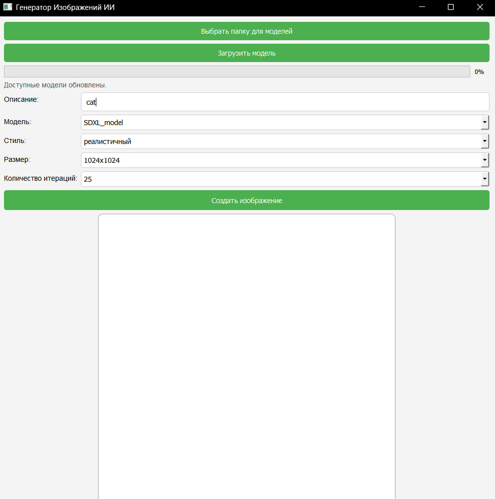

# 🎨 AI Image Generator GUI

Интерфейсное приложение на Python и PyQt5 для генерации изображений с помощью ИИ на основе текстового описания. Поддерживается выбор модели, стиля, размера и количества итераций.



---

## 🚀 Возможности

- Ввод текстового запроса для генерации изображения
- Выбор модели генерации
- Поддержка разных художественных стилей
- Настройка размера изображения
- Задание количества итераций генерации
- Прогресс-бар загрузки модели и генерации
- Поддержка загрузки моделей в отдельную папку

---

## 🛠️ Технологии

- Python 3.11.9
- PyQt5
- PIL / Pillow
- Своя система загрузки моделей (`ModelDownloader`)
- Логирование (`logger.py`)
- Расширяемый класс генерации изображений (`ImageGenerator`)

---

## 📦 Установка

⚠️ **Важно:** требуется установленный Python версии **3.11.9**

```bash
git clone https://github.com/xqbzz/diplom1
cd diplom1
pip install -r requirements.txt
```

---

## 🖥️ Запуск

```bash
python main.py
```

---

## 🧠 Как использовать

1. Выберите папку, где будут храниться модели
2. Загрузите нужную модель (или добавьте вручную в папку)
3. Введите текстовое описание изображения
4. Выберите модель, стиль, размер и количество итераций
5. Нажмите «Создать изображение» и дождитесь результата

---


### 📥 Скачивание модели

Для генерации изображений необходимо загрузить предварительно обученную модель.

🔗 **Скачать мою модель на SDXL**: [Скачать с Google Диска](https://drive.google.com/file/d/17PfBCtftwBa0NdEljS58FG5Uv_4Q7fys/view?usp=drive_link)
Ссылка для скачивания Google Colab: https://colab.research.google.com/drive/1LLTJ8uv4ksbu853qtFQvjqEyb1phitKq?usp=drive_link

> ⚠️ **Обратите внимание:**  
> Если вы используете **SDXL**, в коде генерации должна быть использована `StableDiffusionXLPipeline`.  
> Для обычной **Stable Diffusion** используйте `StableDiffusionPipeline`.

---

## 📂 Структура проекта

```
.
├── gui.py                # Основной GUI
├── image_generator.py    # Логика генерации изображений
├── downloader.py         # Загрузка моделей
├── config.py             # Стили и размеры
├── logger.py             # Логирование
├── models/               # Папка с моделями
└── README.md
```

---

## ✍️ Автор

**Твоё имя**  
[GitHub](https://github.com/xqbzz) • [Telegram](https://t.me/xqbzz)

---


